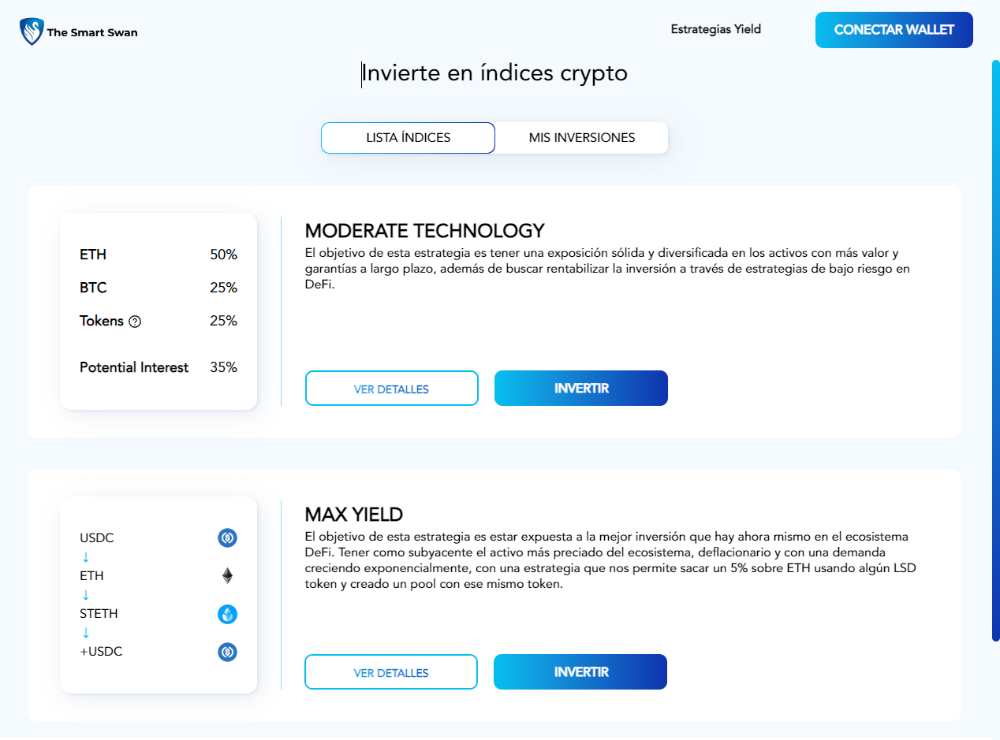

# Guia de Uso The Smart Swan

**Página principal**

### **Acción: Conectar Tu Wallet**

_Descripción:_ Para comenzar a disfrutar de todas las funcionalidades de nuestra plataforma, es necesario conectar tu wallet. Sigue estos pasos para hacerlo:

- Haz clic en el ícono de la cartera (wallet) en la esquina superior derecha de la pantalla.
- Selecciona la opción "Conectar Wallet" en el menú desplegable.

- Aparecerán diferentes opciones de wallets compatibles. Elige la que estés utilizando. Recomendamos utilizar la opción de Metamask
- Sigue las instrucciones para autorizar la conexión entre tu wallet y nuestra plataforma.

- ¡Listo! Tu wallet está ahora conectada y lista para ser utilizada en nuestra web

### **Acción: Invertir en una estrategia**

_Descripción:_ Para comenzar a invertir en una estrategia en nuestra plataforma, sigue estos pasos:

1. **Verificar Saldo:** Antes de comenzar, asegúrate de tener suficiente saldo en tu wallet. La cantidad mínima para invertir es 0.01 ETH en USDC.e . Aunque esta es la cantidad mínima, se recomienda considerar inversiones más substanciales para obtener mejores resultados.
2. **Conectar Wallet:** Si aún no has conectado tu wallet, sigue las instrucciones mencionadas anteriormente en "Conectar Tu Wallet."
3. **Seleccionar Estrategia:** Explora las estrategias disponibles en nuestra plataforma y elige la que mejor se adapte a tus objetivos de inversión.

**Invertir:** Una vez que hayas seleccionado la estrategia, ingresa la cantidad que deseas invertir en la estrategia en el campo correspondiente. La inversión debe ser superior al precio en dólares de 0.01 ETH. Para invertir se utilizará la versión ligada al USD: USDC.e ([Más información sobre USDC.e](https://investorsupport.securitize.io/hc/en-us/articles/7246257432599-USDC-e-vs-USDC-others#:~:text=the%20Avalanche%20Bridge.-,USDC.,to%20fiat%20currency%20with%20USDC.))

**Autorizar Transacción:** Al hacer clic en "Invertir," se te pedirá autorizar la transacción a través de tu wallet conectada. En la imagen, estamos utilizando Metamask como ejemplo.

**Confirmar Transacción:** Revisa los detalles de la transacción, incluyendo la cantidad a invertir y las tarifas asociadas. Una vez estés satisfecho con la información, confirma la transacción.

**Seguimiento de Inversiones:** Una vez que la transacción se haya confirmado, podrás ver el estado de tu inversión en la sección "Mis Inversiones." Aquí encontrarás información sobre el rendimiento de tu inversión, el historial de transacciones y otros detalles relevantes.

Una vez invertido podremos ver el estado de nuestras inversiones en el apartado ‘Mis Inversiones’

### **Acción: Retirar Fondos de una Estrategia**

_Descripción:_ Para retirar fondos de una estrategia en nuestra plataforma, sigue estos sencillos pasos:

**Ingresar a la Estrategia:** En la sección "Mis Inversiones," selecciona la estrategia de la cual deseas retirar fondos haciendo clic en su nombre o título.

- Una vez dentro de la estrategia, encuentra la opción "Retirar" y haz clic en este botón.

**Elegir Cantidad a Retirar:**

- Selecciona la cantidad que deseas retirar de la estrategia. Asegúrate de verificar la cantidad antes de proceder.

- **Confirmar Retiro:**
  - Confirma la transacción haciendo clic en el botón "Retirar" nuevamente.
- **Autorizar Transacción:**
  - Tu wallet conectada te solicitará autorización para realizar la transacción de retiro. Asegúrate de verificar los detalles antes de confirmar.

Confirmaos la transacción y hablemos completado la retirada del dinero:

**Completar Retiro:**

- Una vez que hayas confirmado la transacción, el retiro de fondos será procesado.
- El saldo retirado se reflejará en tu wallet en forma de WETH.

Recuerda que al retirar fondos de una estrategia, recibirás WETH en tu wallet en lugar de USDC.e .Si tienes alguna pregunta o necesitas más información sobre tus retiros, no dudes en contactar a nuestro servicio de atención al cliente. ¡Disfruta de tu experiencia de inversión!
